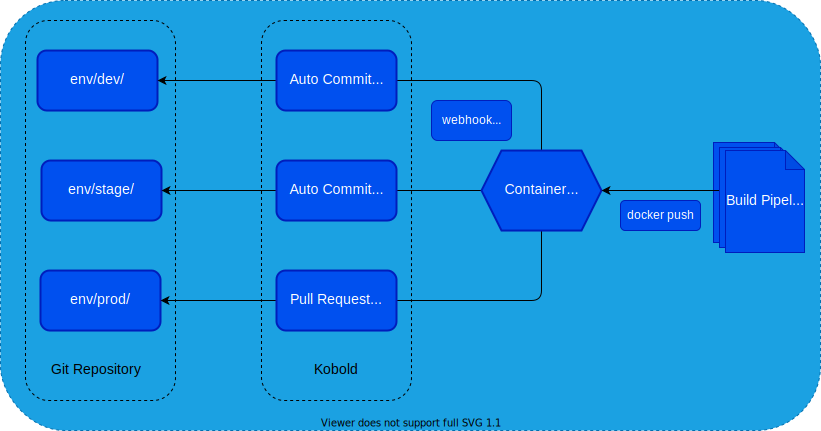

# Introduction

Kobold is a gitbot that reacts to webhook events, typically emitted by container
registries. When it receives an event, it searches one or more configured
repositories for yaml files for image nodes containing a special inline comment.

The presence of this comment signals to kobold that it should act on this image
reference. It then determines if the given image tag should be updated. After it
is done *walking* the repository, it will commit and push the change and
optionally make open a pull request.

It can walk the same repository multiple times with different scopes, i.e. on
/env/dev it should make a direct commit but on /env/prod it should open a pull
request instead.

This provides an agnostic way of updating image references in git repositories.
Typically other tools would take over from here, for example argocd could detect
the changes made by kobold and sync them into the kubernetes cluster.

However, kobold is not bound to any specific tool. It is not even bound to
kubernetes resources. It cant detect image references in other yaml files as
well. For example docker-compose files.

One could even use it to keep a service in sync across multiple application
repositories. Imagine, you build a microservice and it is used for integration
tests in a number of other repositories. Kobold could ensure they stay in sync.
